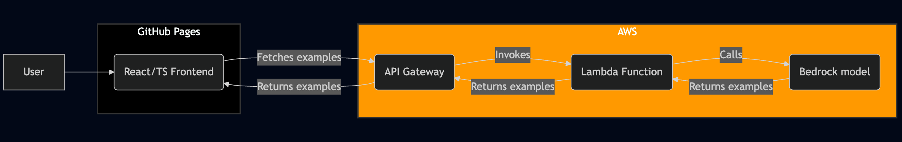

# [ExampleSentences](https://examplesentences.com) 🌍💭

[](https://buymeacoffee.com/lukerogerson)

## What's this?

```
👀 See any word in action, in any language 🗣️
```

Using AI, this app will show you how a word or phrase is used in context. It is completely free ([with some caveats to protect me from a huge bill](#llms-are-expensive-how-is-this-free)).

## How do I use it?

1. Go to [examplesentences.com](https://examplesentences.com).
2. Enter a word or phrase in the search bar.
3. The app will generate a list of examples for your word or phrase in the detected language, as well as a pronunciation guide and an English translation.
4. You can click the "Copy" button to copy the examples to your clipboard.
5. If you found it useful, please consider [buying me a coffee](https://buymeacoffee.com/lukerogerson)!

## Why is this useful?

I like learning languages (mainly Chinese). I often know a word, but don't really know how to use it in context. Dictionaries sometimes have examples, but often don't. This app is my attempt to solve this problem.

## What's the tech stack?

The frontend is a simple React/TypeScript app deployed on GitHub Pages for ease (and it's free!). The backend is using AWS API Gateway, Lambda (built with Go) and Bedrock - deliberately kept very simple. Terraform is used for IaC.



## Which Bedrock model is used?

The model used is the `amazon.nova-lite-v1` model. I tested a bunch of [foundation models](https://docs.aws.amazon.com/bedrock/latest/userguide/models-supported.html) and ultimately picked this one as it was a good balance between quality (in terms of interesting and varied examples for the requested word) and [price](https://aws.amazon.com/bedrock/pricing/). It didn't require any extra fine-tuning.

## LLMs are expensive. How is this free?

Unlike the vast majority of AI applications today, this educational tool is truly free. There's no sign-up required, no credit card needed, and absolutely no demand for you to bring your own API key (like OpenAI's) – just immediate, cost-free access.

However, this is still a real application that costs money to run. The bulk of the cost is Bedrock calls, which are billed "serverlessly" per request based on input and output token count.

Some back of the hand maths:

Nova Lite costs $0.00006 per 1,000 input tokens and $0.00024 per 1,000 output tokens. Assuming a typical request uses 50 input tokens and and 400 output tokens, and allowing for 1000 requests per day, that works out roughly as:

- $0.099 per day
- $2.97 per month
- $35.64 per year

So for this kind of usage, costs are negligible.

My plan to keep it free for the end user is aggressive rate limits and a daily total request limit in order to cap costs in case some unscrupulous character abuses the system.

I looked into using AWS WAF for this, but it sadly does not support a daily total request limit. I could of course introduced some state (eg. DynamoDB) to track the total requests, but I wanted to not have to introduce any state to the system.

I discovered that API Gateway has a feature called [usage plans](https://docs.aws.amazon.com/apigateway/latest/developerguide/api-gateway-create-usage-plans-with-console.html#api-gateway-usage-plan-create). It allows you to set a limit on the number of requests per day via an API key, as well as enforce rate limiiting.. It's not a brilliant solution and won't scale, but it works well for a small amount of traffic, is free, and allows me to focus on the core functionality.

## Is it open-source?

Yes. I've deliberately built it to be easily forked and deployed elsewhere. The entire backend can be spun up in a few Terraform commands (see the `infra` folder for the Terraform code and the `Makefile` for the commands).

### Troubleshooting

#### Error: creating API Gateway Domain Name (yourdomain.com): Certificate **_ in account _** not yet issued

1. Go to ACM and find the created certificate.
2. Click into it and find the validation record (CNAME name and value).
3. Go to your domain registrar and create a CNAME record with the name and value found in the previous step.
4. Wait for the certificate to be issued (it should show status "Issued" in ACM).
5. Run `make plan` and `make apply` again.

#### How do I hook up my custom domain to API Gateway?

You should create an A alias record for your custom domain pointing to the API Gateway's target domain name.

Create an A alias record with:

```
- Record Name: yourdomain.com
- Record Type: A (Alias)
- Alias Target: {target_domain_name}
- Alias Hosted Zone ID: {hosted_zone_id}
```
